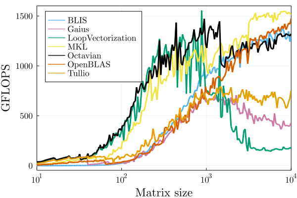

(Noctua 1, single-socket, i.e. 20 threads.)

## Reproducibility

Used Julia version: 1.7.2

1. Instantiate the Julia environment with
```julia
using Pkg
Pkg.instantiate()
```
2. Run
```
julia --project -t <NUM_THREADS> bench.jl
```
where `<NUM_THREADS>` should be the number of available CPU threads.

Note that `bench.jl` is also a SLURM job script that can be `sbatch`ed. Just adapt the header for your cluster.
