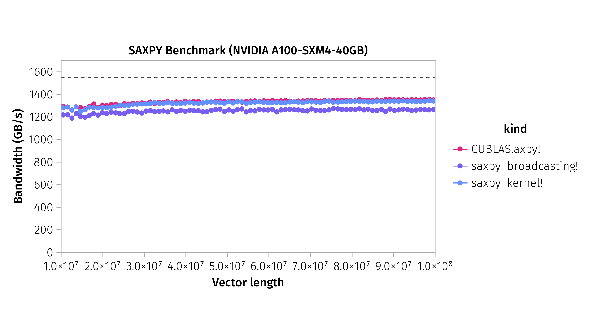

(Considered GPU: NVIDIA A100 SXM4 GPU)

## Reproducibility

Used Julia version: 1.7.0

1. Instantiate the Julia environment with
```julia
using Pkg
Pkg.instantiate()
```
2. Run
```
julia --project bench.jl
```
